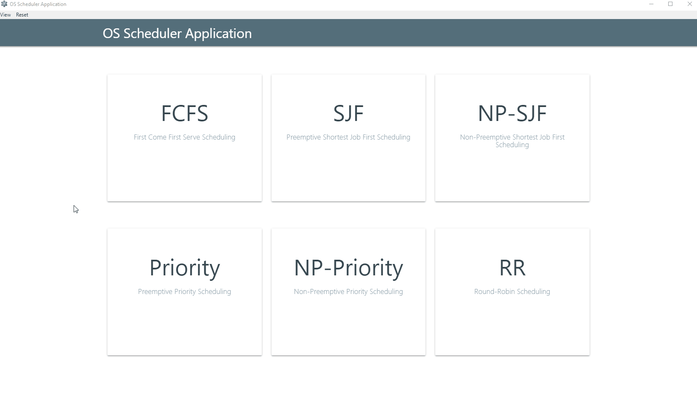

# OS Scheduler Application

An [Electron](https://electronjs.org/) desktop application for simulating major operating system scheduling algorithms.

---

The app uses [EJS](https://ejs.co/) templates, and [Express](https://expressjs.com/). The core app (scheduling algorithms) is written in JavaScript.

An [old version](<https://github.com/ahmedkrmn/OS-Scheduler-Application/tree/pure-html>) of the app uses HTML instead of EJS and Express, but there was a separate HTML page for each algorithm page which were identical for the most part except the titles and some minor changes in the tables so I thought having a new version using EJS and Express would be more convenient. 

## Application Features

- Simulate the execution of the most well known OS scheduling algorithms, the app contains the following algorithms:
  - First Come First Serve
  - Shortest Job First - Preemptive
  - Shortest Job First - Non Preemptive
  - Priority - Preemptive
  - Priority - Non Preemptive
  - Round Robin
- Real time simulation. No need to refill the process table to add a process like other scheduling simulation applications
- Remove a process and re-simulate with one click
- Input validation

## How To Get The App

### Build From Source

Make sure you have [Node.js](https://nodejs.org/) installed then follow the steps below.

1. Fork the repo or download the current branch as [zip](https://github.com/ahmedkrmn/OS-Scheduler-Application/archive/master.zip)

2. `cd` into the project directory and run `npm install`

3. To package the app, run :
   - `npm run package:linux` for Linux
   - `npm run package:win` for Windows
   - `npm run package:mac` for Mac

   **This assumes you're on a x64 architecture, modify the `package.json` file to package for x32**

